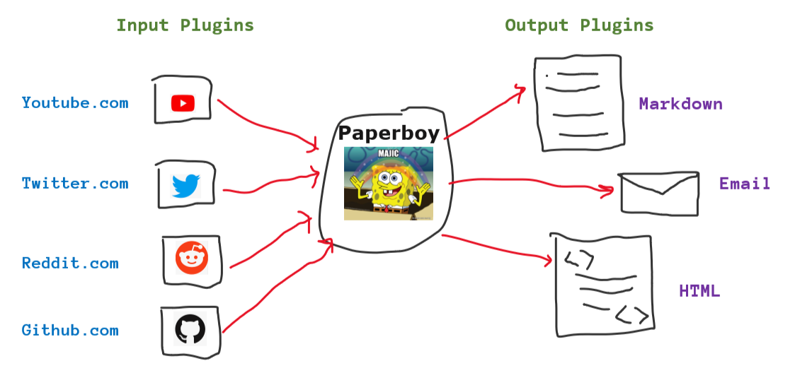

# paperboy

CLI newsletter generator on basis of keywords like "powershell", "azure", "aws"

For now it captures information from the following data sources:

* Editor picks: blogs, articles, podcast
* Trending Repositories on @Github
* Trending Developers on @Github
* Top Tweets
* Top @reddit posts
* New on @YouTube
* Bestseller books on @leanpub

<hr>

## How it works?



<hr>

## Requirements

* PowerShell v7
* Python v3
* Chrome and Latest Chromium driver

<hr>

## Please Note

* Experimental (*Work in progress)
* Expect bugs in the code, still a very early stage of this project
* Not tested on Linux\Mac (Will be done gradually)
* Heavily uses:
    * Python for API calls, web automation and scrapping
    * Powershell is used to sanitize the data and acts as glue to bring everything together

<hr>

## How to run this?

1. Clone this repository
2. Go to the root folder of the repository
3. Create a `secrets.txt` file like one below in the root directory of the repository when you clone it locally. This just a hack, and will be replaced by proper credential management once the project is mature.

    Purpose of this file is to get the secrets and tokens for twitter and youtube APIs

    ```txt
    # just a hack to to twitter keys/tokens, will work on a better solution later

    # twitter
    consumer_key=####################################
    consumer_secret=####################################
    token=####################################
    token_secret=####################################

    # youtube
    DEVELOPER_KEY=####################################
    YOUTUBE_API_SERVICE_NAME=####################################
    YOUTUBE_API_VERSION=####################################
    ```

4. Run `spawner.ps1` and pass an argument to the `-subject` like `aws`, `azure`, `powershell` etc, see the following screenshots
    
    
5. Sit back for few minutes while it captures information and sanitizes it.
6. Output would be generated in an HTML file (I'm planning to write more plugins like Markdown\Email etc, but for now we only have HTML)
7. If you open the HTML file you'll see output like this 👇
    
    [](https://www.youtube.com/watch?v=M-N0OJy6WtI)
